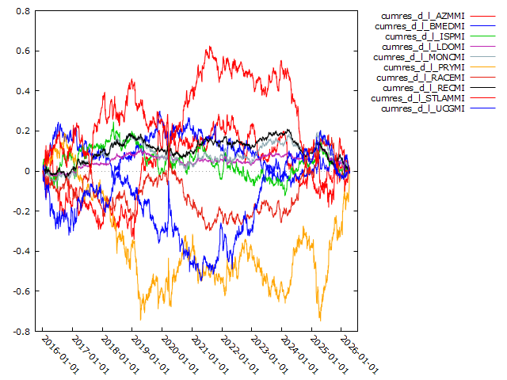
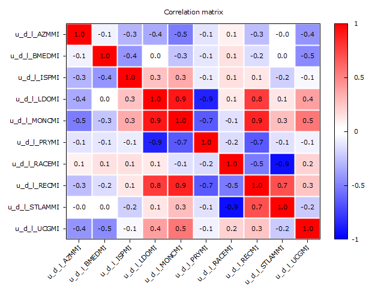
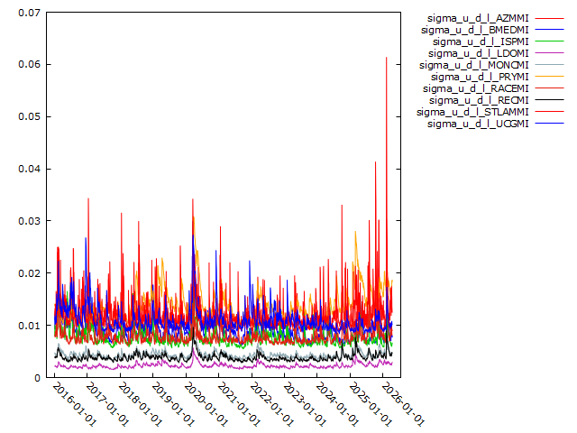
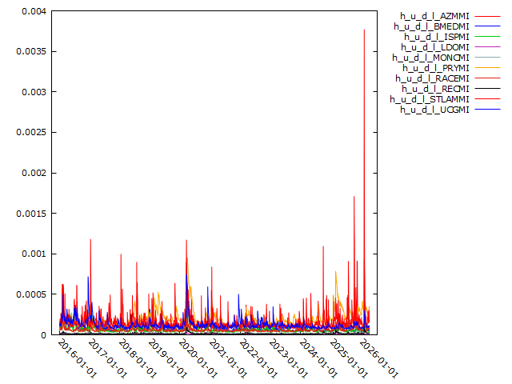

# pca-based-factor-garch-model

Principal Component Analysis (PCA), factor modeling, and GARCH(1,1) volatility estimation applied to Italian equity returns. The project analyzes systematic and idiosyncratic risk dynamics through residual diagnostics, stationarity tests, and conditional heteroskedasticity modeling.

---

# Econometric Framework

The project applies a PCA-based factor decomposition combined with GARCH volatility modeling to a panel of Italian equity return series.

The econometric procedure consists of the following steps:

1. Principal Component Analysis (PCA)
2. Factor regression
3. Extraction of idiosyncratic residuals
4. Residual diagnostics
5. ARCH effects testing
6. GARCH(1,1) volatility estimation

---

# 1. Principal Component Analysis (PCA)

Given a panel of stock returns:

$$
X_t = (x_{1t}, x_{2t}, ..., x_{Nt})'
$$

PCA is applied to the correlation matrix of returns in order to extract common systematic factors.

The decomposition is:

$$
X_t = \Lambda F_t + \varepsilon_t
$$

where:

- $X_t$ = vector of stock returns
- $\Lambda$ = matrix of factor loadings
- $F_t$ = vector of principal components
- $\varepsilon_t$ = idiosyncratic component

The first five principal components are retained because they explain more than 80% of the cumulative variance:

$$
\frac{\sum_{i=1}^{5}\lambda_i}{\sum_{i=1}^{N}\lambda_i} \geq 0.80
$$

where $\lambda_i$ are the PCA eigenvalues.

---

# 2. Factor Regression Model

Each stock return is regressed on the first five principal components:

$$
r_{i,t} = \alpha_i + \beta_{i1}PC1_t + \beta_{i2}PC2_t + \beta_{i3}PC3_t + \beta_{i4}PC4_t + \beta_{i5}PC5_t + u_{i,t}
$$

where:

- $r_{i,t}$ = return of asset $i$
- $PCk_t$ = k-th principal component
- $u_{i,t}$ = idiosyncratic residual

Robust standard errors are used to account for heteroskedasticity.

---

# 3. Idiosyncratic Residuals

The residuals:

$$
u_{i,t} = r_{i,t} - \hat{r}_{i,t}
$$

represent the portion of returns not explained by the common systematic factors.

Cumulative residuals are also computed:

$$
CU_{i,t} = \sum_{s=1}^{t} u_{i,s}
$$

in order to analyze the persistence of idiosyncratic shocks over time.


---

# 4. Residual Correlation Analysis

The correlation matrix of residuals is computed:

$$
Corr(u_i, u_j)
$$

to verify whether the PCA factor decomposition successfully removes common dependence across assets.

Lower residual correlations indicate that systematic co-movements have been captured by the PCA factors.



---

# 5. Residual Autocorrelation

Correlograms are computed for the residuals in order to analyze serial dependence.

The autocorrelation function is:

$$
\rho_k = \frac{Cov(u_t, u_{t-k})}{Var(u_t)}
$$

Residual autocorrelation should be weak after factor extraction.

---

# 6. ADF Stationarity Test

The Augmented Dickey-Fuller test is applied to each residual series:

$$
\Delta u_t = \alpha + \gamma u_{t-1} + \sum_{i=1}^{p}\phi_i \Delta u_{t-i} + \varepsilon_t
$$

Null hypothesis:

$$
H_0 : \gamma = 0
$$

(unit root / non-stationarity)

Rejection of the null indicates stationarity of the residual process.

---

# 7. Normality Test

Normality tests are applied to the residuals.

The null hypothesis is:

$$
H_0 : u_t \sim \mathcal{N}(0,\sigma^2)
$$

In the empirical results, normality is rejected for all residual series, which is consistent with the heavy tails typically observed in financial data.

---

# 8. ARCH Effects

ARCH-LM tests are performed on residuals in order to detect conditional heteroskedasticity.

The variance equation under ARCH dynamics is:

$$
Var(u_t \mid \mathcal{F}_{t-1}) \neq \sigma^2
$$

The ARCH(q) specification is:

$$
\sigma_t^2 = \omega + \sum_{i=1}^{q}\alpha_i u_{t-i}^2
$$

Null hypothesis:

$$
H_0 : \alpha_1 = \alpha_2 = ... = \alpha_q = 0
$$

Rejection of the null indicates the presence of ARCH effects.

Empirical results strongly reject the null for all residual series.

---

# 9. GARCH(1,1) Volatility Model

Conditional volatility is modeled using a GARCH(1,1) process:

$$
u_t = \sqrt{h_t}z_t
$$

with:

$$
z_t \sim IID(0,1)
$$

and conditional variance dynamics:

$$
h_t = \omega + \alpha u_{t-1}^2 + \beta h_{t-1}
$$

where:

- $h_t$ is the conditional variance
- $\sqrt{h_t}$ is the conditional volatility
- $\omega > 0$
- $\alpha$ measures the impact of past shocks
- $\beta$ measures volatility persistence

  






# Main Empirical Findings

- The first five principal components explain more than 80% of total variance.
- ADF tests reject the unit-root null for all residuals.
- Normality tests reject Gaussian residuals for all assets.
- ARCH-LM tests detect significant conditional heteroskedasticity.
- GARCH(1,1) models successfully capture volatility clustering in idiosyncratic residuals.

---

# Software

The analysis is implemented in Gretl using:

- Principal Component Analysis (PCA)
- OLS factor regressions
- Robust standard errors
- ADF unit-root tests
- Normality tests
- ARCH-LM tests
- GARCH(1,1) volatility models
- Gnuplot visualization tools

---

# Repository Structure

```text
PCA.inp      Gretl econometric script
README.md    Project documentation
```
